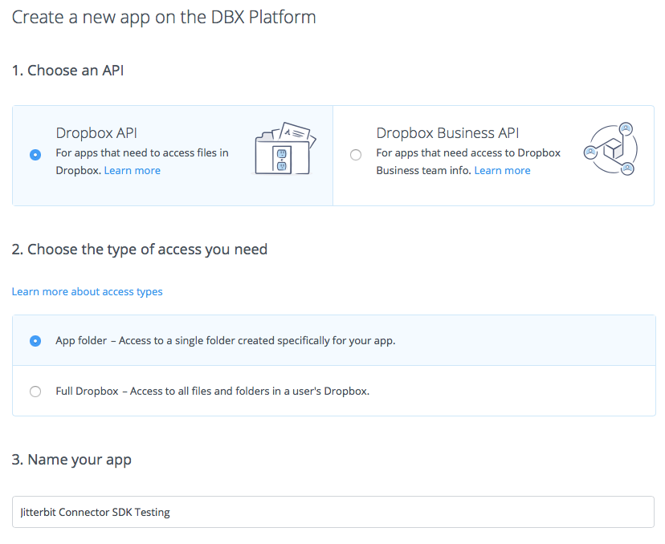

# Dropbox Registration

## Introduction

As the connection will be an application that interfaces with Dropbox, you will need to register at Dropbox as a
developer and create a Dropbox application using the Dropbox API. The application can have any name and settings. This
can be done with a free Dropbox account.

## Dropbox App Creation and Authorization Steps

At the Dropbox website, [create an app](https://www.dropbox.com/developers/apps/create):

From that application's web page, obtain its app key and generate an access token. This image shows (outlined in red)
where these can be obtained on the web page:

In this example, an application called **Jitterbit Connector SDK Testing** has been created. The app key is shown as
"xxxxxxxxxxxxxxx". The access token will be displayed once the button **Generate** below the label **Generated access
token** has been used.

Click the **Generate** button to generate the access token, copy both the app key and access token, and store them
safely where you can retrieve them when configuring the connector.

Note the setting of the **App folder name** (outlined in blue). In this example, this is the root folder on Dropbox from
where any files you reterive or place with the connector will originate.

## Related Pages

- [Jitterbit Harmony Dropbox Connector](./index.md)
- [Jitterbit Harmony Dropbox Connection](./connection.md)
- [Jitterbit Harmony Dropbox Fetch File Activity](./fetch-file-activity.md)
- [Jitterbit Harmony Dropbox Get File Activity](./get-file-activity.md)
- [Jitterbit Harmony Dropbox Process File Activity](./process-file-activity.md)
- [Jitterbit Harmony Dropbox Put File Activity](./put-file-activity.md)
